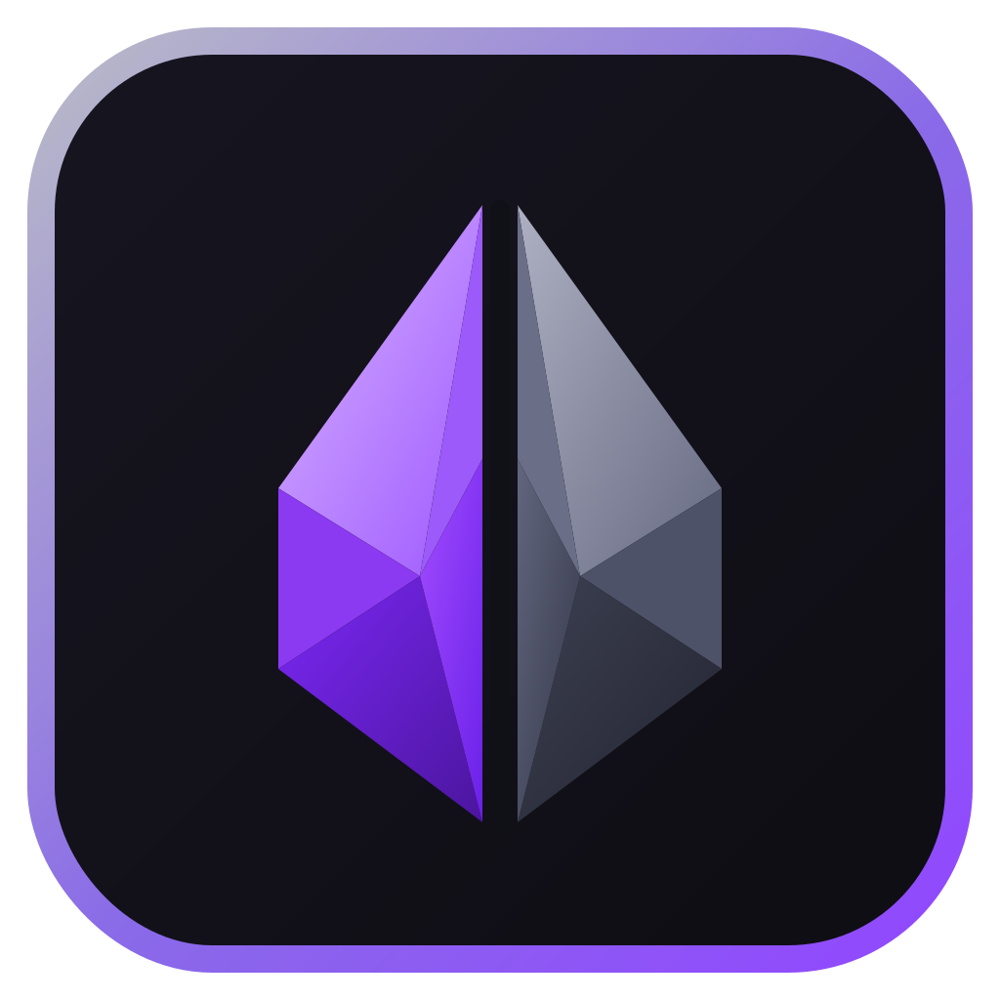

  

<h1 align="center">Dropper</h1>

<strong>Twitch Drops: Track and Redeem</strong>

  A Twitch Drops companion for tracking watch time, monitoring progress, managing eligible streams, and redeeming rewards.

  
  
  
  
  
  

## Install

  
  
  

## What Dropper Does

- Tracks Twitch-credited Drop progress and watch time.
- Redeems completed Twitch Drops and claims channel point bonus chests.
- Skips subscription-required Drops and continues with watch-time rewards.
- Keeps eligible streams active while Twitch is in the background.
- Maintains a Stream Queue of eligible backup channels and can switch when progress stalls or a stream goes offline.
- Completes all watch-time Drops for the current game before moving to the next eligible game.
- Shows a compact Drop inventory, progress, ETA, campaign state, and current reward.
- Includes minimized progress, background earning status, diagnostics, notifications, and update/changelog notices.
- Uses a Twitch-themed interface with dedicated full-size and launcher icon assets.

## License

**Code:** [PolyForm Noncommercial License 1.0.0](LICENSE-CODE.md)  
**Artwork and documentation:** [CC BY-NC-SA 4.0](LICENSE-ASSETS.md)

See [NOTICE.md](NOTICE.md) for the split-license notice.

## Disclaimer

Dropper is an independent project and is not affiliated with or endorsed by Twitch.
