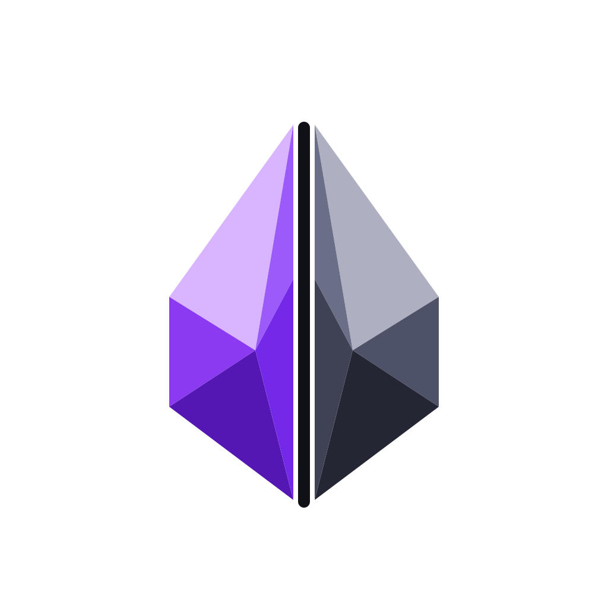
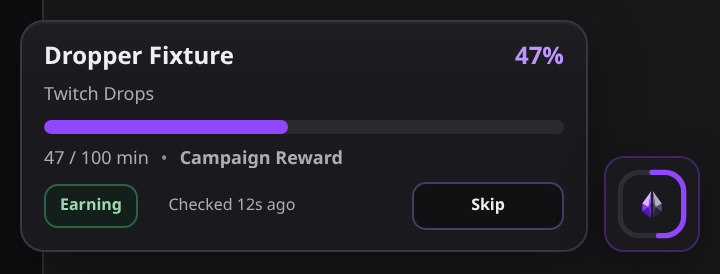
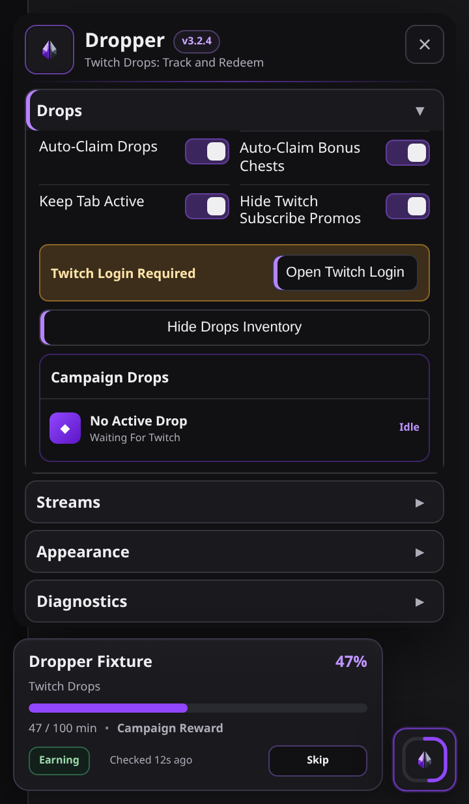
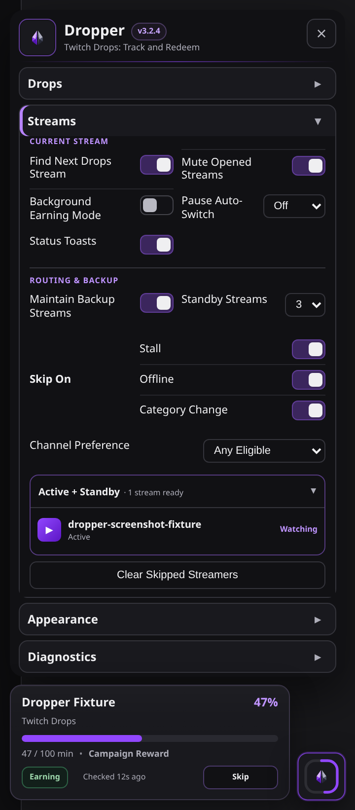
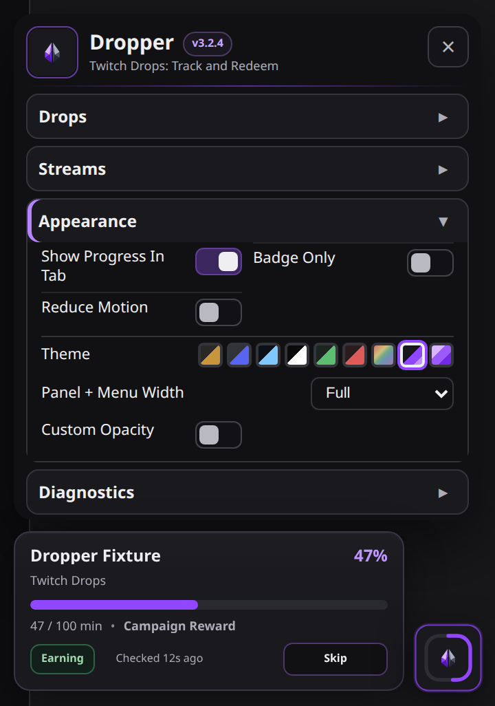
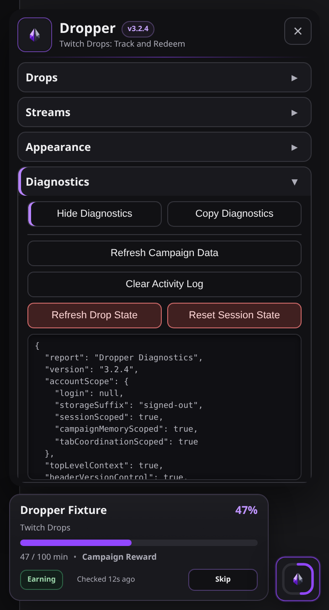

  

<h1 align="center">Dropper</h1>

<strong>Twitch Drops: Track and Redeem</strong>

  Dropper is a browser-only Twitch companion for the streams you choose to watch. Track Twitch-credited reward progress, manage campaigns, collect earned rewards, and stay in control of playback and stream switching.

  
  
  
  
  
  

## Install

  
    
  

## What Dropper Does

- Tracks Twitch-credited Drop progress and watch time in real time.
- Can auto-claim available rewards and channel point bonus chests without blocking watch progression.
- Finds, verifies, and switches to eligible Drops streams when needed.
- Maintains backup stream candidates and recovers from stalled, offline, or category-changed streams.
- Shows campaign, reward, streamer, category, watch-time, and progress details in one compact interface.
- Lists open campaigns by game and lets you ignore selected games until their latest campaign ends.
- Keeps campaign progress, routing state, and multi-tab coordination isolated per Twitch account.

## Viewing and reward controls

Manually selected channels are protected from automatic navigation. **Resume Playback** authorizes playback only; **Use Automatic Switching** permits routing without clearing a pause. The existing Skip Streamer confirmation remains an explicit choice. Pauses are retained through player replacements and reloads in the same tab. Fullscreen, picture-in-picture, and a hidden tab do not imply permission to resume or switch.

**Keep Screen Awake** uses the browser's screen wake-lock capability during real playback where supported. Dropper does not override page visibility, focus, or native pause methods, and does not dispatch simulated activity.

Claim History distinguishes sent attempts, confirmed rewards, already-claimed results, retryable failures, and unconfirmed results. A page click alone is never counted as a reward. Unknown responses and integrity/permission failures need attention rather than aggressive retries. Bonus clicks without authoritative confirmation remain unconfirmed. Up to 100 records are retained per account. Web Locks coordinate claims across tabs when available; the fallback leader check is advisory, not an atomic guarantee.

Campaign priorities order eligible recommendations. Explicitly ineligible, disconnected, missing-prerequisite, and cyclic-prerequisite rewards are excluded. Unknown prerequisite timing is not converted into a precise total. Twitch-credited progress remains authoritative.

## Optional support

Dropper is free to use for personal, noncommercial purposes under its software license. Donations are optional and support continued development. All features remain available without donating, and donations do not change your license rights.

## Implementation notes

This feature set is implemented against Dropper's approved behavior specification. No implementation from twitch-autoclaim or TwitchDropsMiner is imported in this change. This is not a claim of a legally audited clean-room process. Existing licensing notices remain unchanged. No donation destination is configured.

## Screenshots

<table>
  <tr><th width="20%">Progress panel</th><th width="20%">Drops</th><th width="20%">Streams</th><th width="20%">Appearance</th><th width="20%">Diagnostics</th></tr>
  <tr><td align="center"></td><td align="center"></td><td align="center"></td><td align="center"></td><td align="center"></td></tr>
</table>

## Diagnostics and product compatibility

Use **Show Diagnostics** / **Hide Diagnostics**, then **Copy Diagnostics** when troubleshooting. Reports include **Page**, **Technical**, **Console**, and **Plugin** sections, identify active ExtraPotions products and visible conflicts on the current page, and are never uploaded automatically.

## License

**Code:** [PolyForm Noncommercial License 1.0.0](LICENSE-CODE.md)  
**Artwork and documentation:** [CC BY-NC-SA 4.0](LICENSE-ASSETS.md)

See [NOTICE.md](NOTICE.md) for the split-license notice.

## Disclaimer

Dropper is an independent project and is not affiliated with or endorsed by Twitch.
