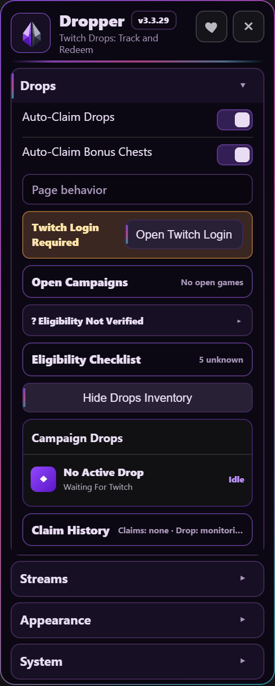
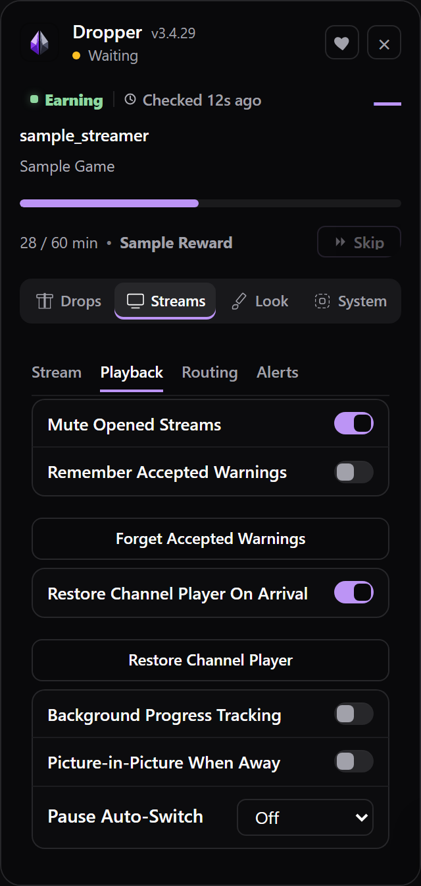

# Dropper

Current release: **3.4.16**.

**Follow your Twitch Drops from watch time to reward**

Track Twitch-credited progress, manage eligible streams, and claim available rewards from a compact menu.

## Get started

1. Install a userscript manager such as [Violentmonkey](https://violentmonkey.github.io/get-it/) or [Tampermonkey](https://www.tampermonkey.net/).
2. [Install Dropper](https://github.com/ExtraPotions/Dropper/releases/latest/download/dropper.user.js) and confirm in your userscript manager.
3. Refresh Twitch and open the product launcher.

Sign in to Twitch and open the Dropper launcher. Check Drops for progress and claim options, then Streams for stream-switching preferences. Twitch determines eligibility and credited watch time.

## What you can do

- **Distinct menu colors:** Dropper keeps its signature appearance alongside other ExtraPotions products.
- **Accurate category routes:** Rainbow Six Siege and Overwatch (now the Overwatch 2 directory) open their correct Twitch directories, including after an older route was saved.
- **Bounded stream discovery:** after two minutes without a compatible visible stream, try another eligible campaign and revisit the deferred campaign after five minutes. If no alternative exists, keep waiting for a compatible stream.
- **System status:** see Working, Waiting, Paused, or Needs attention, with a reason and a safe recovery action when available.
- **Recent progress:** see the last 30 progress and recovery events in System. Repeated recovery switches pause until you choose Resume.
- **Campaign-aware stream choices:** restricted campaigns use their listed channels, with known restrictions retained across Twitch page changes. If recovery pauses, System explains why and offers Resume recovery.

- **Simple System menu:** Status stays open with its reason and recovery action, plus recent activity. Support holds Copy Diagnostics and Report a Problem. Reset asks for a second tap inside the menu.

- **Readable menus:** choose Standard (14px text), Large (16px), or Extra Large (18px) from Appearance > Menu Preferences. Captions start at 12px. Labels, dropdowns, toggles, and buttons share consistent spacing and alignment. The choice applies to ExtraPotions menus on this site.

- **Interruption rules:** set quiet hours, protect channels from automatic switching, exclude channels, or stay on a stream while it is earning. Quiet hours also silence browser alerts.
- **Honest progress:** show progress as pending when Twitch has not supplied it. Eligible streams and confirmed reward credit have separate status indicators.
- **Claims:** optionally claim available Drops and collect channel-point bonus chests automatically throughout a stream. Bonus checks continue alongside Drop checks, including later bonuses after an earlier claim.
- **Stream management:** use Twitch’s current campaign information to verify eligible streams, and recover when a stream goes offline, changes category, or stops progressing.
- **Campaign browsing:** explore open campaigns and ignore games you do not want to follow.
- **Your preferred layout:** keep progress by the launcher or use Badge Only to place it at the top of the menu.
- **Your controls:** move the launcher and tune how the menu behaves from Appearance and System.
- **Saved preferences:** your userscript manager keeps your settings. Existing preferences move automatically, and Reset All Settings clears them.

## See it in action

Screenshots show the current product with sample content.

<table>
  <tr>
    <td width="50%" valign="top" align="center"> <strong>Drop progress and claim controls</strong></td>
    <td width="50%" valign="top" align="center"> <strong>Stream switching and recovery</strong></td>
  </tr>
</table>

## Support

[Support development](https://ko-fi.com/expdare). Donations are optional. All features remain available without donating.

## License

**Code:** [PolyForm Noncommercial License 1.0.0](LICENSE-CODE.md) 
**Artwork and documentation:** [CC BY-NC-SA 4.0](LICENSE-ASSETS.md)

## About

Dropper is an independent project and is not affiliated with or endorsed by Twitch.

Smaller install files keep installation lightweight without removing features.
